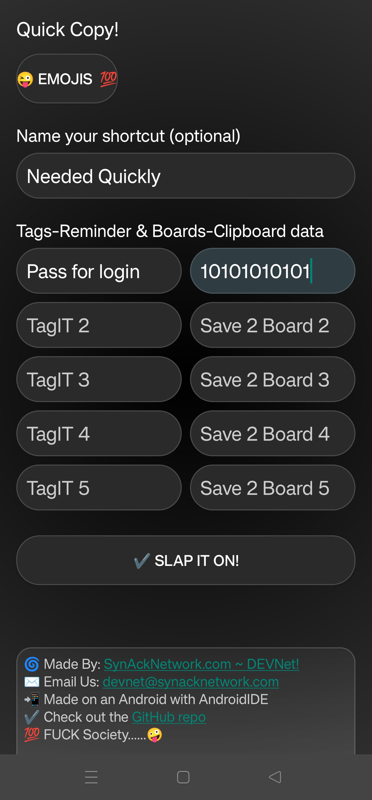
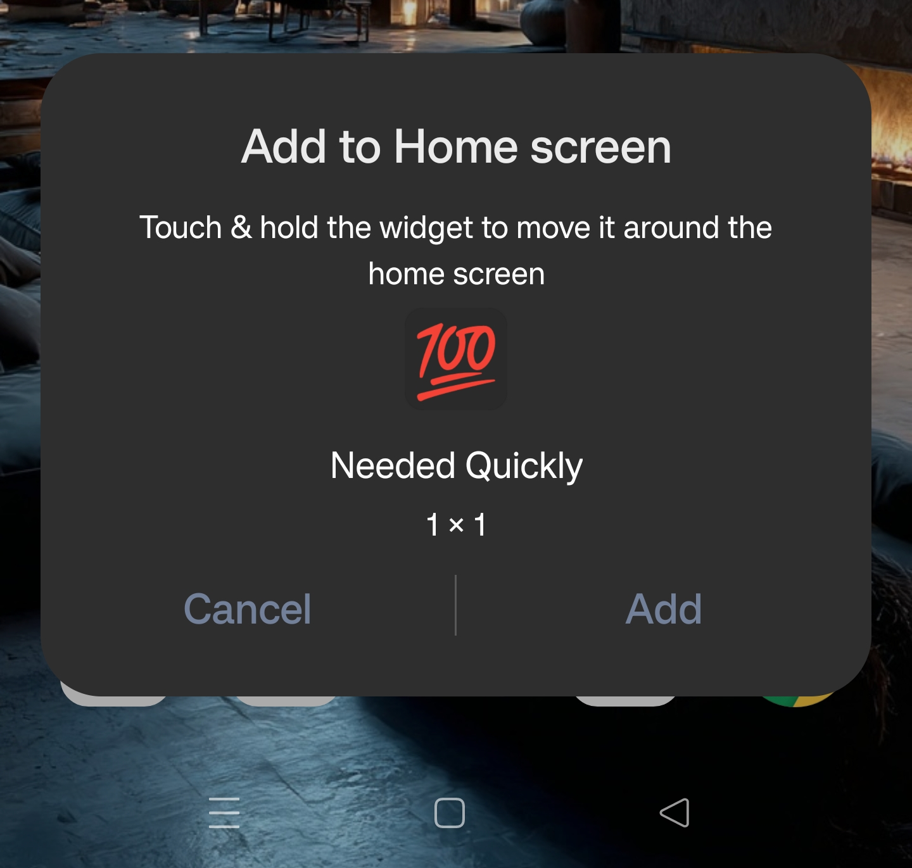
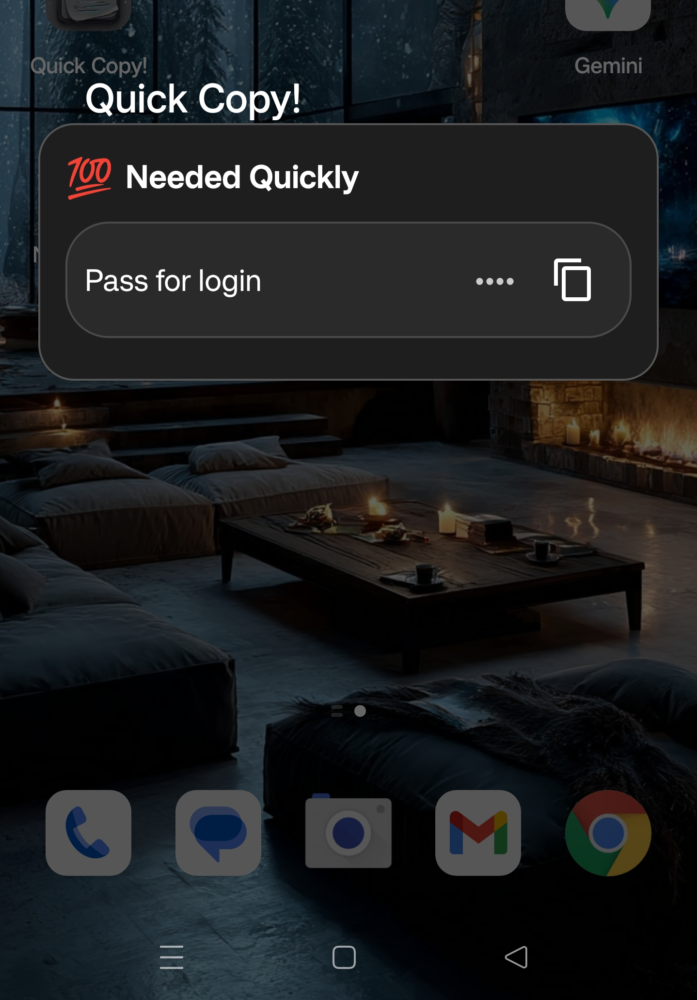

# QuickCopy Droid

QuickCopy is a lightweight Android app that lets you **create custom shortcuts** on your home screen for quickly copying data to your clipboard.  
Designed for speed, customization, and style, built entirely on AndroidIDE.

# [CLICK HERE!](#download)!! ToGo straight to the compiled .APK and Download Link! 😜🏴‍☠️😜🏴‍☠️😜💯

---

## 🚀 Features

- 🔘 **Custom Shortcut Creation**  
  Pick an emoji icon or use text initials as your shortcut icon.

- ✍️ **Custom Names**  
  Each shortcut can be given a unique name (defaults to *Quick Copy* if blank).

- 📋 **Save Tags & Values**  
  Up to **5 hint/value pairs** per shortcut.  
  - *Tags* help you identify the data.  
  - *Values* are copied to your clipboard instantly.

- 📱 **Pinned Shortcuts**  
  Adds shortcuts directly to your Android home screen for 1-tap copying.

- 🎨 **Dark Theme**  
  Black & grey 360° gradient background with rounded modern buttons.

---

## ⚙️ How It Works

1. Open **QuickCopy**.  
2. Tap **Pick Icon** → choose an emoji (or let the app use your shortcut name initials).  
3. Fill in a **name** (optional).  
4. Add up to 5 **Tag / Value** rows.  
   - Example:  
     - Tag: *Email* → Value: *user@email.com*  
     - Tag: *API Key* → Value: *1234-5678*  
5. Tap **Create Shortcut** → it gets pinned to your Android home screen.  
6. Tap the shortcut any time → a clean popup shows your saved data, ready to copy.

---

## 🖼️ Screenshots

Here’s a look at **QuickCopy Droid** in action:





---

## 🔧 Tech Stack

- Java (Android)  
- XML layouts  
- Android ShortcutManager API  
- HTML-enabled footer (clickable links & optional marquee scrolling)  
- Built on **AndroidIDE** (no PC needed)

---

## 📦 Installation

Clone this repo and build with AndroidIDE or Android Studio:

## 📥 Download the pre-compiled .APK!
<a name="download"></a>

[](https://github.com/ceaserone/QuickCopy_Droid/raw/main/QuickCopy.apk)

```bash
git clone https://github.com/ceaserone/QuickCopy_Droid.git

